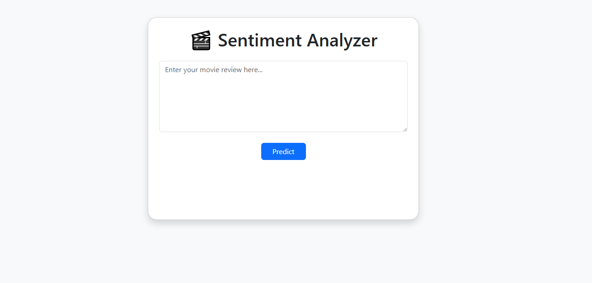
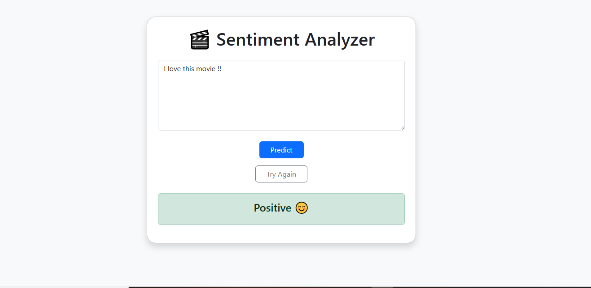
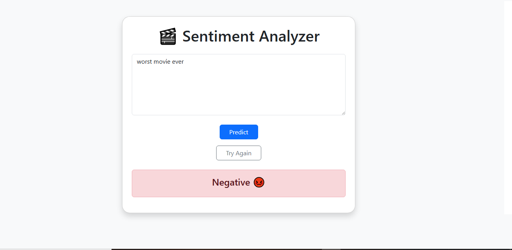

# 🎬 Sentiment Analyzer

A Machine Learning based Sentiment Analysis web application built using Flask and Scikit-learn.

The application predicts whether a movie review is Positive or Negative.

---

## 🚀 Features

- Predicts sentiment from user text
- Clean and simple UI
- Flask web application
- TF-IDF Vectorization
- Machine Learning model integration
- Real-time sentiment prediction

---

## 🛠 Technologies Used

- Python
- Flask
- Scikit-learn
- Pandas
- HTML
- Bootstrap

---

## 🧠 Machine Learning Workflow

1. Text preprocessing
2. Tokenization
3. TF-IDF Vectorization
4. Model Training
5. Prediction using Flask App

---

## 📸 Application Preview

### 🏠 Home Page



---

### 😊 Positive Prediction



---

### 😡 Negative Prediction



---

## 📂 Project Structure

```text
sentiment-analyzer/
│
├── data/
├── models/
├── notebooks/
├── screenshots/
├── src/
├── templates/
│   └── index.html
│
├── app.py
├── README.md
└── requirements.txt

---

## ▶️ How to Run

### 1. Clone the repository

```bash
git clone https://github.com/ali-mlengineer/sentiment-analyzer.git
```

### 2. Install dependencies

```bash
pip install -r requirements.txt
```

### 3. Run the Flask application

```bash
python app.py
```